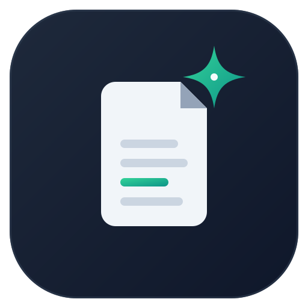
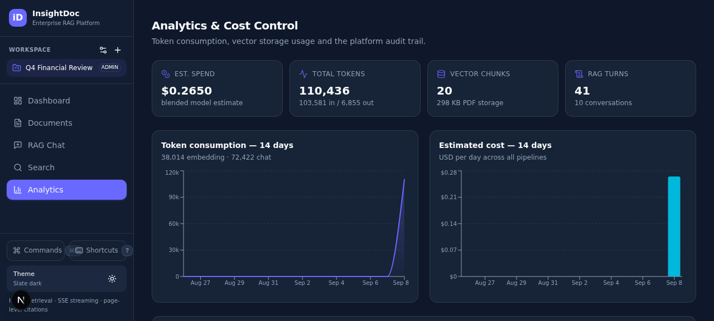
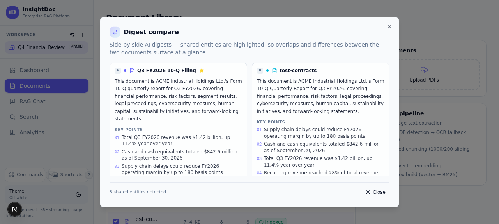
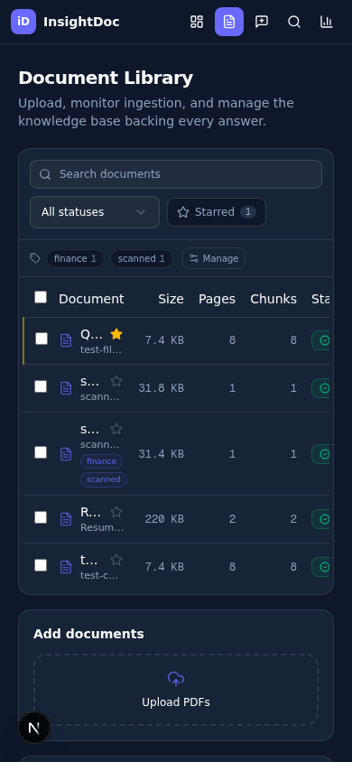

<div align="center">



# InsightDoc

**Autonomous PDF Analytics & Vector Search Pipeline**

Enterprise-grade RAG platform — ingest dense PDFs, interrogate them with streamed,
citation-grounded answers, and jump to the exact source page.

[](LICENSE)
[](https://nextjs.org)
[](https://typescriptlang.org)
[](https://prisma.io)
[](https://react.dev)
[](docs/DEPLOYMENT.md)

</div>

---

InsightDoc turns a pile of PDFs into a queryable knowledge base. Upload a document and it
flows through an observable ingestion pipeline — checksum de-duplication → text extraction →
OCR fallback for scans → structure-aware chunking → embedding → hybrid index — and becomes
answerable within seconds. Every chat reply streams token-by-token with **inline citations
that deep-link to the exact page** of the source PDF, rendered side-by-side in a split-screen
viewer.

## Highlights

| | |
|---|---|
| 📥 **Ingestion pipeline** | Upload → dedupe (SHA-256) → extract (unpdf) → OCR fallback (tesseract.js) → structure-aware chunking → embed — with live per-phase progress, retry/backoff and a failed-document review flow |
| 🔎 **Hybrid retrieval** | BM25 keyword + cosine vector similarity fused with Reciprocal Rank Fusion and score-weighted reranking |
| 💬 **Grounded chat** | SSE token streaming, strict grounding prompt, page-accurate citations, follow-up suggestions, regenerate/feedback loop, rename/pin/export |
| 📝 **AI digests** | Map-reduce executive summaries with key points, entities and suggested questions — shareable into any chat, comparable side-by-side across documents with shared-entity highlighting |
| 🖨️ **OCR for scans** | Scanned documents without a text layer are routed through tesseract.js with live `i/N` page progress |
| 📊 **Analytics** | Token & cost tracking, latency percentiles, ingest throughput, search-quality feedback + human review queue |
| 🎙️ **Voice I/O** | Speech-to-text input and read-aloud narration (single seamless WAV) |
| ⌨️ **Power UX** | Command palette, keyboard shortcuts, prompt library, tag governance, bulk actions, multi-workspace, dark/light themes, fully responsive 320 px → 4K |

| Analytics | Digest compare | Mobile |
|---|---|---|
|  |  |  |

## Architecture (sandbox → production mapping)

```
┌────────────────────────── Browser (SPA at /) ──────────────────────────┐
│  Dashboard · Documents · Search · Chat (split-screen + PDF viewer) ·    │
│  Analytics            — Zustand store, command palette, shortcuts       │
└───────────────────────────────┬────────────────────────────────────────┘
│ REST + SSE
┌───────────────────────────────▼────────────────────────────────────────┐
│  Next.js App Router — /api/v1/*                                        │
│  workspaces · documents · chunks · search · chats(stream) · summaries   │
│  analytics · activity · audio(ASR/TTS) · feedback-review                │
│                                                                        │
│  ┌──────────────┐  ┌──────────────┐  ┌──────────────────────────────┐  │
│  │ Job queue    │→ │ Worker:      │  │ Retrieval engine:            │  │
│  │ in-process,  │  │ extract →    │  │ BM25 + cosine → RRF fuse →   │  │
│  │ retry/backoff│  │ OCR → chunk →│  │ score-weighted rerank        │  │
│  │              │  │ embed        │  └──────────────────────────────┘  │
│  └──────────────┘  └──────┬───────┘                                    │
│                           │                                            │
│  Prisma (SQLite → Postgres-ready)   EmbeddingService (swappable)       │
│  Local object storage (→ S3/R2-ready)  z-ai SDK (LLM/TTS/ASR)          │
└────────────────────────────────────────────────────────────────────────┘
```

The stack ships with zero-config local infrastructure (SQLite, in-process queue, disk
storage) behind clean abstractions, so every piece can be upgraded independently —
see [docs/ARCHITECTURE.md](docs/ARCHITECTURE.md).

## Quickstart

> Requires **Node.js ≥ 20.9** (or [Bun](https://bun.sh) ≥ 1.1). Bun is used by the dev
> tooling scripts; the app itself runs on either runtime.

```bash
# 1. Install dependencies
bun install            # or: npm install

# 2. Configure environment
cp .env.example .env   # defaults work out of the box locally

# 3. Create the database
bun run db:push        # creates db/custom.db from prisma/schema.prisma

# 4. Start
bun run dev            # http://localhost:3000
```

Upload a PDF and you're live: ingestion usually completes in a few seconds
(OCR documents take longer — progress is shown per page).

### Useful scripts

| Command | What it does |
|---|---|
| `bun run dev` | Dev server on port 3000 |
| `bun run build` | Production build (used by Vercel) |
| `bun run build:standalone` | Self-contained build for Docker/bare metal |
| `bun start` | Serve the standalone build (`build:standalone` first) |
| `bun run lint` | ESLint |
| `bun run typecheck` | Strict TypeScript check (`tsc --noEmit`) |
| `bun run smoke` | End-to-end smoke suite (upload→dedupe→ingest→search→SSE answer→feedback→digest→cleanup) |
| `bun run db:push` | Push `prisma/schema.prisma` to the database |
| `bun run brand` | Regenerate icons/OG images from `public/brand/*.svg` |

## Environment variables

Copy `.env.example` → `.env` and adjust. Full reference with deployment notes lives
inside that file.

| Variable | Required | Description |
|---|---|---|
| `DATABASE_URL` | ✅ | Prisma connection string. Default: `file:../db/custom.db` (relative to `prisma/`) |
| `NEXT_PUBLIC_SITE_URL` | ⬜ prod | Canonical origin — drives metadata, OpenGraph, `robots.txt`, `sitemap.xml` |
| `AI_API_KEY` | ✅ serverless | AI provider API key. On Vercel set this **and** `AI_BASE_URL` |
| `AI_BASE_URL` | ✅ serverless | AI provider base URL (e.g. OpenAI / Gemini / Groq / OpenRouter) |
| `AI_MODEL` | ⬜ | AI model identifier (default: `gemini-3.1-flash-lite`) |
| `INSIGHTDOC_OCR` | ⬜ | `1` (default) enables the OCR fallback, `0` disables |
| `INSIGHTDOC_OCR_MAX_PAGES` | ⬜ | Max OCR pages per document (default `12`) |

## Deployment

InsightDoc deploys anywhere Next.js runs. The three supported paths, in order of
fidelity:

1. **Vercel** (recommended first deploy) — zero-config for the app itself; pair with
   a hosted Postgres for persistence. → [docs/DEPLOYMENT.md](docs/DEPLOYMENT.md)
2. **Docker / bare metal** — full functionality with SQLite + local disk out of the box. →
   `docker compose up` (see [docs/DEPLOYMENT.md](docs/DEPLOYMENT.md))
3. **Any Node host** — `bun run build:standalone && bun start`.

### Production readiness checklist

- ✅ Strict TypeScript (`typecheck` clean, `ignoreBuildErrors: false`)
- ✅ Security headers (`X-Content-Type-Options`, `X-Frame-Options`, `Referrer-Policy`, `Permissions-Policy`, no-store on `/api/*`)
- ✅ `postinstall` runs `prisma generate` (CI/serverless safe)
- ✅ SEO: metadata API, OpenGraph + Twitter cards, JSON-LD (SoftwareApplication + FAQ), `robots.txt` incl. AI crawlers, `sitemap.xml`, PWA manifest, `llms.txt` / `ai.txt`
- ✅ Brand kit: favicon.ico (multi-size), SVG/PNG icons, apple-touch-icon, OG image — all generated from `public/brand/`
- ✅ `.env.example`, `.gitignore` (secrets/runtime data excluded), MIT `LICENSE`
- ✅ Smoke suite: `bun run smoke` (15 checks)

## Project structure

```
├── src/
│   ├── app/                    # Next.js App Router (SPA at /, API under /api/v1)
│   │   ├── layout.tsx          # Metadata API (SEO/OG/Twitter), fonts, toaster
│   │   ├── page.tsx            # JSON-LD structured data + app mount
│   │   ├── robots.ts / sitemap.ts / manifest.ts
│   │   └── api/v1/…            # REST + SSE endpoints
│   ├── components/insightdoc/  # Feature components (5 views, dialogs, palette)
│   │   └── ui/                 # shadcn/ui primitives
│   ├── server/                 # queue, storage, RAG retriever, worker, ai bootstrap
│   ├── lib/                    # db, embeddings, chunker, tokenizer, schemas
│   └── hooks/                  # use-toast, use-mobile
├── prisma/schema.prisma        # Data model (workspace → document → chunk → chat…)
├── public/brand/               # Logo + OG design sources (SVG)
├── docs/                       # DEPLOYMENT · ARCHITECTURE · API
├── scripts/                    # Dev harness: smoke suite, PDF fixtures, brand builder
└── db/                         # SQLite data (git-ignored)
```

## Documentation

| Doc | Contents |
|---|---|
| [docs/DEPLOYMENT.md](docs/DEPLOYMENT.md) | Vercel, Docker, self-host; database & storage upgrade paths; troubleshooting |
| [docs/ARCHITECTURE.md](docs/ARCHITECTURE.md) | Ingestion pipeline, retrieval engine, data model, swap-out abstractions |
| [docs/API.md](docs/API.md) | REST + SSE endpoint reference |
| [CONTRIBUTING.md](CONTRIBUTING.md) | Dev workflow, commit conventions, QA expectations |
| [SECURITY.md](SECURITY.md) | Reporting policy and hardening notes |
| [CHANGELOG.md](CHANGELOG.md) | Release history |

## Contributing

PRs are welcome! Read [CONTRIBUTING.md](CONTRIBUTING.md) for the workflow. Before opening
a PR: `bun run lint && bun run typecheck && bun run smoke` should all pass.

## License

[MIT](LICENSE) — free to use, modify and ship.
